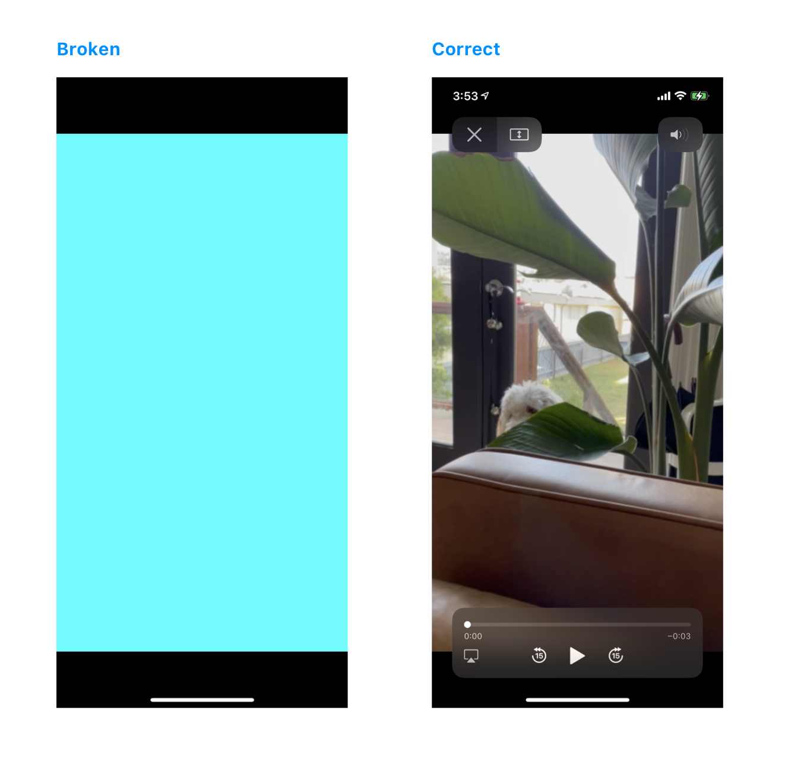

# HDR Export Bug

Demonstrates an issue exporting HDR videos from the photos library with various presets. It appears that HDR videos shot on iPhone 12 Pro and exported via `PHImageManager.requestAVAssetExportSession()` with certain lower quality presets will result in a video that does not play properly. The audio seems to play fine, but the video is a solid color.

**Failing Presets**
- AVAssetExportPresetLowQuality
- AVAssetExportPresetMediumQuality
- AVAssetExportPreset
- AVAssetExportPreset960x540

## Using this sample code
Build and run this via Xcode on a device running iOS 14. Xcode 11 and iOS 14 is required. Make sure you either have HDR video content in your photo library, or import the sample file `sample.MOV` from this repo to your photo library.

1. Choose the preset and various settings by tapping the settings icon in the top left
2. Tap the "+" button in the top right
3. Choose an HDR video asset from your library
4. The video will be exported with the current settings
5. Tap the filename of the video you just exported to see if it plays properly